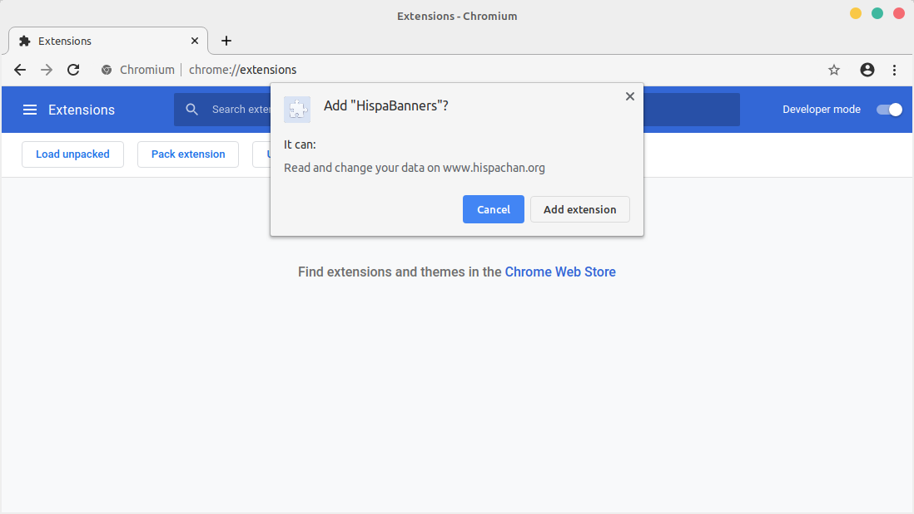
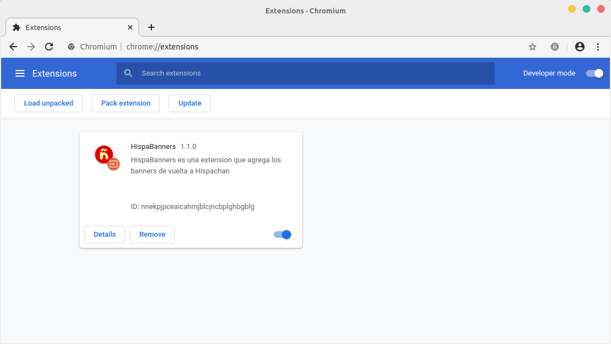

# HispaBanners
HispaBanners aspira ser un userscript con el objetivo de poner los banners de hispachan de nuevo.

## Instalacion

### Chrome

1. [Descarga la extensión](https://github.com/1-byte-man/HispaBanners/releases/download/1.1.1/HispaBanners.crx) y dirigete a [chrome://extensions](chrome://extensions/)

2. Arrastra el archivo crx previamente descargado hacia la ventana, aparecera el siguiente mensage preguntando si deseas agregar la extension.

3. Acto seguido la extension se agregara

### Firefox

Para instalar HispaBanners en el navegador Firefox solo debemos seguir los siguientes pasos:

1. [Descarga la extensión](https://addons.mozilla.org/es/firefox/addon/hispabanners/)

2. Aceptas ~~el ransonguar~~ los permisos para la ejecución del script

3. Acto seguido la extension se descargará y agregará.

## Browsers support

|  Firefox |  Chrome |  Samsung |  Opera |  Electron |
| --------- | --------- | --------- | --------- | --------- |

## TODO
Actualmente el userscript necesita:
1. Ser empaquetado como extensión para firefox (trabajo en proceso)
2. Ser empaquetado como extensión para Chrome (y opcionalmente para sus skins)
3. Perratencionar el userscript por todos los tablones (especificamente /di/ para que aumenten el repertorio de banners)

## Licencia

La licencia usada en este proyecto es GPLv3 Para mas detalles vease el archivo [LICENCE](LICENsE)
